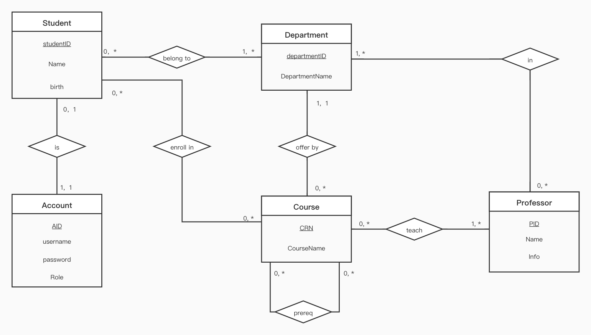

# Conceptual Design

- Team Name: The-Lab-Rats
- Members:
   - Keyuan Huang (keyuanh2@illinois.edu)
   - Ziyue Guo (ziyueg5@illinois.edu)
   - Yiyan Wang (yiyanw3@illinois.edu)  
- Captain: Keyuan Huang
- Project Title: Course Registration Platform

## ER/UML Diagram

## Relational Schema

Student (Student_ID INT [PK], Student_Name VARCHAR(100), birth DATE, AID INT [FK to Account.AID]);

Department (Department_ID INT [PK], Department_Name VARCHAR(100));

Account (AID INT [PK], username VARCHAR(100), password VARCHAR(100), Role VARCHAR(100));

Course (CRN INT [PK], Course_Name VARCHAR(100), Professor VARCHAR(100), Department_ID INT [FK to Department.Department_ID]);

Professor (PID INT [PK], Professor_Name VARCHAR(100), info VARCHAR(100));

Belong_to (Department_ID INT [PK] [FK to Department.Department_ID], Student_ID INT [PK] [FK to Student.Student_ID]);

Enroll_in (Student_ID INT [PK] [FK to Student.Student_ID], CRN INT [PK] [FK to Course.CRN]);

Prereq (CRN INT [PK] [FK to Course.CRN], Pre_CRN INT [PK] [FK to Course.CRN]);

In (PID INT [PK] [FK to Professor.PID], Department_ID INT [PK] [FK to Department.Department_ID]);

Teach (PID INT [PK] [FK to Professor.PID], CRN INT [PK] [FK to Course.CRN]);

## Description and Assumption

1. **Account** - Account table stores all the login information, including the students and the administrators. Each user will get a unique AccountID(AID) when they sign up. Every student can only have one account in our platform.
2. **Student** - Each student is uniquely identified by studentID, which is the same as the UID that we currently have. We think that every student might have different majors offered by different department.
3. **Department** - Department table stores all the department in our college. Each department is uniquely indentified by it's departmentID
4. **Professor** - Professor is uniquely identified by ProfessorID(PID), we assume that professor can work for multiple different departments at the same time.
5. **Course** - Each course is uniquely identified by Course Registration Number(CRN). Every department will offer any number of courses, every professor can 
teach any number of courses in one single semester. Student can enroll in multiple courses in each semester. We assume for some high level courses, there might be any number of prerequisite courses. 

