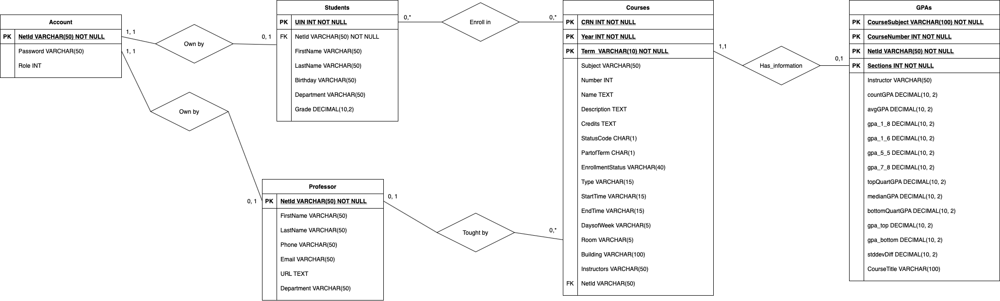

# Conceptual Design

- Team Name: The-Lab-Rats
- Members:
   - Keyuan Huang (keyuanh2@illinois.edu)
   - Ziyue Guo (ziyueg5@illinois.edu)
   - Yiyan Wang (yiyanw3@illinois.edu)  
- Captain: Keyuan Huang
- Project Title: Course Registration Platform

## ER/UML Diagram

## Relational Schema

Account (NetId VARCHAR(50) [PK] [NOT NULL] , Password VARCHAR(50) [NOT NULL], Role INT);

Students (UIN INT [PK] [NOT NULL], NetId VARCHAR(50) [NOT NULL] [FK to Account.NetId], FirstName VARCHAR(50), LastName VARCHAR(50), Birthday VARCHAR(50), Grade DECIMAL(10, 2));

Professor (NetId VARCHAR(50) [PK] [NOT NULL] [FK to Account.NetId], FirstName VARCHAR(50), LastName VARCHAR(50), Phone VARCHAR(50), Email VARCHAR(50), URL TEXT, Department VARCHAR(50));

Courses (CRN INT [NOT NULL] [PK], Year INT [NOT NULL], Term VARCHAR(10) [NOT NULL], Subject VARCHAR(50), Number INT, Name TEXT, Description, TEXT, Credits, TEXT, Status CHAR(1), PartofTerm CHAR(1), EnrollmentsStatus VARCHAR(40), Type VARCHAR(15), StartTime VARCHAR(15), EndTime VARCHAR(15), DaysofWeek VARCHAR(5), Room VARCHAR(5), Building VARCHAR(100), Instructors VARCHAR(50), NetId VARCHAR(50) [FK to Professor.NetId]);

GPAS (CourseSubject VARCHAR(100) [PK] [NOT NULL], CourseNumber INT [NOT NULL], NetId VARCHAR(50) INT [NOT NULL], Section INT [PK] [NOT NULL], Instructor VARCHAR(50), countGPA DECIMAL(10, 2), avgGPA DECIMAL(10, 2), gpa_1_8 DECIMAL(10, 2), gpa_1_6 DECIMAL(10, 2), gpa_5_5 DECIMAL(10, 2), gpa_7_8 DECIMAL(10, 2), topQuanrtGPA DECIMAL(10, 2), medianGPA DECIMAL(10, 2), bottomQuartGPA DECIMAL(10, 2), gpa_top DECIMAL(10, 2), gpa_bottom DECIMAL(10, 2), stddevDiff DECIMAL(10, 2), CourseTitle VARCHAR(100))

Enroll_in (UIN INT [NOT NULL] [PK] [FK To Students.UIN], CRN INT [NOT NULL] [PK] [FK to Courses.CRN])

## Description and Assumption

### Table Description and Assumption 
1. **Account** - Account table stores all the login information, including the students and the professor (Administrator). Each user will get a unique NetId when they sign up. Every student can only have one account in our platform.
2. **Student** - Each student is uniquely identified by UIN. We think that every student might have different majors offered by different department.
3. **Professor** - Professor is uniquely identified by NetId.
4. **Course** - Each course is uniquely identified by Course Registration Number(CRN), Year, and Term. Every professor can 
teach any number of courses in one single semester. Student can enroll in multiple courses in each semester. 
5. **GPA** - This table stores the GPA information of each course. Each GPA information is uniquely identified by CourseSubject, CourseNumber, Section, and the Professor NetId. 

### Relation Description and Assumption 
1. **Own by  (Both Student and Professor)** - Every account is own by either student or professor (We treat professor as administrator in our project).
2. **Enroll in ** - Every student can enroll in multiple courses and multiple students can be enrolled in one courses.
3. **Tought by ** - Each course is tought by professor. We assume that every course can only be taught by at most one professor, and one professor can teach multiple courses.
4. **Has_information ** - Each course will have GPA information related to that course. There exists some new course that doesn't have any information yet. 
