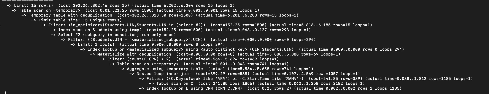
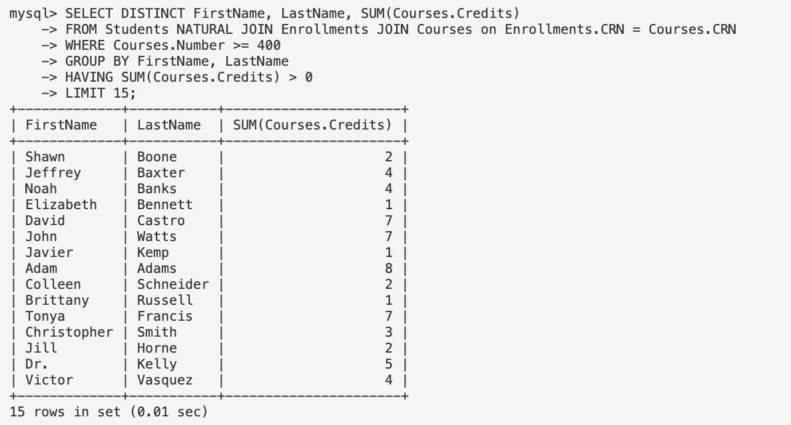

## DDL
* Table Courses
```SQL
CREATE TABLE IF NOT EXISTS Courses ( 
    CRN INT NOT NULL, 
    Year INT , 
    Term VARCHAR(10), 
    YearTerm VARCHAR(10) NOT NULL, 
    Subject VARCHAR(5), 
    Number INT, 
    Name TEXT, 
    Description TEXT, 
    Credits TEXT, 
    SectionInfo TEXT, 
    DegreeAttribute TEXT, 
    ScheduleInfor TEXT, 
    Section VARCHAR(5), 
    StatusCode CHAR(1), 
    PartofTerm CHAR(1), 
    SectionStatus VARCHAR(50), 
    EnrollmentStatus VARCHAR(40), 
    Type VARCHAR(5), 
    StartTime VARCHAR(15),
    EndTime VARCHAR(15), 
    DaysofWeek VARCHAR(5),
    Room VARCHAR(5), 
    Building VARCHAR(100), 
    Instructors VARCHAR(50),
    PRIMARY KEY (CRN, YearTerm)
);
```

* Table ProfessorCourseGPA
```SQL
CREATE TABLE IF NOT EXISTS ProfessorCourseGPA ( 
    Instructor VARCHAR(50) NOT NULL, 
    countGPA DECIMAL , 
    avgGPA DECIMAL, 
    gpa_1_8 DECIMAL, 
    gpa_1_6 DECIMAL, 
    topQuartGPA DECIMAL, 
    medianGPA DECIMAL, 
    bottomQuartGPA DECIMAL, 
    gpa_5_6 DECIMAL, 
    gpa_7_8 DECIMAL, 
    gpa_top DECIMAL, 
    gpa_bottom DECIMAL, 
    stddevDiff DECIMAL, 
    sections INT NOT NULL, 
    course VARCHAR(20) NOT NULL, 
    CourseTitle VARCHAR(100), 
    CourseSubject VARCHAR(10),
    PRIMARY KEY (Instructor, sections, course)
);
```

* Table Enrollments
```SQL
CREATE TABLE IF NOT EXISTS Enrollments ( 
    UIN VARCHAR(50) NOT NULL, 
    CRN INT NOT NULL, 
    PRIMARY KEY (UIN, CRN), 
    FOREIGN KEY (UIN) REFERENCES Students(UIN), 
    FOREIGN KEY (CRN) REFERENCES Courses(CRN)
);
```

* Table Account
```SQL
CREATE TABLE Account (
    NetId    VARCHAR(50) PRIMARY KEY, 
    PassWord VARCHAR(50), 
    ROLE     INT
);
```

* Table Students
```SQL
CREATE TABLE Students (
    UIN        VARCHAR(50) PRIMARY KEY, 
    NetId      VARCHAR(50) NOT NULL REFERENCES Account (NetId),
    FirstName  VARCHAR(50),
    LastName   VARCHAR(50),
    Birthday   VARCHAR(50),
    Department VARCHAR(50),
    Grade      INT
);
```

* Table Professor
```SQL
CREATE TABLE Professor (
    NetId      VARCHAR(50) PRIMARY KEY,
    FirstName  VARCHAR(50),
    LastName   VARCHAR(50),
    Phone      VARCHAR(50),
    Email      VARCHAR(50),
    URL        text,
    Department VARCHAR(50)
);
```
 * Corresponding Insert DDLs

## Tables with Records over 1,000


## Advanced SQL queries
### Query 1
```SQL
SELECT DISTINCT FirstName, LastName 
FROM Students 
WHERE UIN IN (SELECT UIN 
              FROM Enrollments E 
              INNER JOIN Courses C ON E.CRN = C.CRN 
              WHERE DaysofWeek LIKE "%R%" OR StartTime LIKE "%AM%" 
              GROUP BY UIN
              HAVING COUNT(E.CRN) > 2)
LIMIT 15;
```


- Baseline:

- Index on 'StartTime' in Courses Table:

- Index on 'DaysofWeek' in Course Table:

- Index on 'DaysofWeek' and 'StartTime' in Courses Table:

- Analyze: Among all the indexing selection, the second one, which creates index on 'StartTime' in the courses table gives best result with this query. The performance of third and forth indexing design are similar to the baseline. Therefore, we decided to choose our table on 'StartTime'. This is because, as in the 'where' clause, we need the courses start in the morning, which makes the result concentrate the start time in that time period.

### Query 2
```SQL
SELECT DISTINCT FirstName, LastName, SUM(Courses.Credits)
FROM Students NATURAL JOIN Enrollments JOIN Courses on Enrollments.CRN = Courses.CRN 
WHERE Courses.Number >= 400
GROUP BY FirstName, LastName
HAVING SUM(Courses.Credits) > 0
LIMIT 15;
```



- Baseline:

- Index on 'Credits' in Courses Table:

- Index on 'Number' in Course Table:

- Index on 'Credits' and 'Number' in Courses Table:

- Analyze: This time, all other indexing design give a similar performance. The baseline gives best result with this query. Therefore, we'll choose the baseline as our indexing design.
