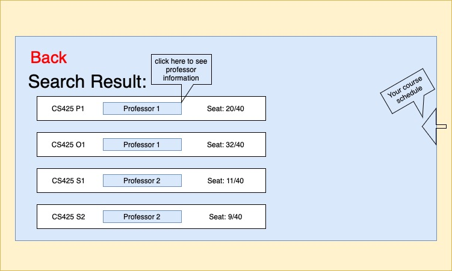

# Course Registration Platform
- Members:
   - Keyuan Huang (keyuanh2@illinois.edu)
   - Ziyue Guo (ziyueg5@illinois.edu)
   - Yiyan Wang (yiyanw3@illinois.edu)  

## Detailed Description

We plan to build a brand new course registration platform with a modern web design that allows students to register courses in an easy and intuitive way. We want to enhance the user experience in the following ways:
-  While searching for courses, the platform will allow the student to find a course by course name, CRN, professor, semester, etc.
-  While browsing courses, our platform allows students to easily access class descriptions, professor’s intro, and any other information that they need before choosing a class.
-  While selecting classes, the platform allows students to visualize their current schedule with selected courses to check potential conflicts. Additionally, our platform also allows administrators to maintain and update the course information.

Additionally, our platform also allows administrators to make any necessary changes, including modifying course schedule, overwrite registration, and so on.

## Usefulness

As college students, we use course registration platforms before every semester starts. A bad UI design of the platform not only delivers misleading information to students but also ruins our academic experience. Our registration system with website design will help our students conveniently search for and register courses and enhance their academic experience.

Similar to the registration system we currently have, ours will allow students to register, drop, and withdraw from a course. However, there are tremendous limitations in the current system, such as inconvenient search functionality and an outdated user interface. These will be the main components that we’ll be focusing on in our project -- an intuitive search engine and an attractive UI. We'll provide a detailed discussion in the Functionalities session.

## Realness

Our data consists of two parts:

First, to simulate the actual course registration system we currently have, we will take the course and professor information from our university website. In order to obtain the data, we’ll either do web scraping or manually input all the information. 

The Second part is the student data. Since we are unable to get the actual student information, we plan to generate fake student data with some API, such as [Faker](https://faker.readthedocs.io/en/master/), and randomly assign them to different courses. 

## Functionalities

### Data Stored
We’ll store student, course, professor, enrollment, and account information into our database. 

### Basic Functions 
Our website will allow students to search, register, and drop classes; allow administrators to perform any tasks(including delete a course, overwrite registration, etc). 
### Creative Component

We plan to add multiple components to our system to help students make decisions while browsing courses. 
- Our system allows keyword search and advanced search. If students are casually looking for some courses that they are interested in, they can use keyword search and type in any related words. If they know what they need, they can do advanced searches by selecting CRN, department, etc.
- The system will provide all of the information related to the courses. Once students find a course they're interested in, we will provide them with professor’s information and course information, such as ratings and GPA distribution. 
- Our system also helps student manage their schedule. If students select the course, our system will allow students to visualize the current calendar. 

With these functionalities, we think we will be able to give our students a great experience.

### Web Page:

This is the search result page. On this page, students can access the professor's page by clicking his/her name. Once the student chooses a course, a calendar will pop up from the right to allow the student to visualize the current schedule. 

## Work Distribution(Subject to change): 
- Database Design: *Ziyue Guo* 
   - Design database schema, import data 
- Process Data: *Yiyan Wang*
   - Pull data from school website, generate fake student and enrollment information
- UI Design: *Keyuan Huang*
   - Design web page, create web application with framework
- Database operation: *Ziyue Guo*
   - Create a simple user interface that performs CRUD
- Search : *Yiyan Wang*
   - Create UI that performs search function
- Other: *Keyuan Huang*
   - Connect database to front-end and host it on GCP
 
